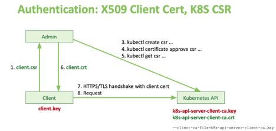

# Kubernetes learning nodes

## Part I Concept

### 1. The Kubernetes Object Model

Kubernetes objects are persistent entities in the Kubernetes system. Object entities describe:

- What containerized applications we are running.
- The nodes where the containerized applications are deployed.
- Application resource consumption.
- Policies attached to applications, like restart/upgrade policies, fault tolerance, ingress/egress, access control, etc.

you have to set `spec` when you create the object, providing a description of the characteristics you want the resource to have: its desired state.

The `status` describes the current state of the object, supplied and updated by the Kubernetes system and its components. 

#### 1.1. Required Fields in an object manifest

- `apiVersion` 		- Which version of the Kubernetes API you're using to create this object
- `kind` 				- What kind of object you want to create
- `metadata` 			- Data that helps uniquely identify the object, including a `name` string, `uid`, and optional `namespace`
- `spec` 				- What state you desire for the object

#### 1.2. Object Names and IDs

four types of commonly used name constraints for resources.
- DNS Subdomain Names: <= 253 char, alphanumeric or '-', start with and end with an alphanumeric char.
- RFC 1123 Label Names: <= 63 char, alphanumeric or '-', start with and end with an alphanumeric char.
- RFC 1035 Label Names: <= 63 char, alphanumeric or '-', start with an alphabetic char and end with an alphanumeric char.

#### 1.3. Namespaces

In Kubernetes, namespaces provides a mechanism for isolating groups of resources within a single cluster.

`namespace`s by default:

		default           Active   1d
		kube-node-lease   Active   1d
		kube-public       Active   1d
		kube-system       Active   1d

**hands-on:** 

- [Creating a Namespace](./create-a-namespace/) 

#### 1.4. Labels and Selectors

Labels are key/value pairs that are attached to objects, such as pods. Labels are intended to be used to specify identifying attributes of objects that are meaningful and relevant to users, but do not directly imply semantics to the core system.

**Labels syntax and character set**

Labels are **key/value** pairs. 

**Valid label keys have two segments**: an optional **prefix** and **name**, separated by a slash `/`. 

- The **name** segment is required and must be 63 characters or less, beginning and ending with an alphanumeric character ([a-z0-9A-Z]) with dashes (-), underscores (_), dots (.), and alphanumerics between. 
- The prefix is optional. If specified, the **prefix** must be a DNS subdomain: a series of DNS labels separated by dots (.), not longer than 253 characters in total, followed by a slash (/).
- The kubernetes.io/ and k8s.io/ prefixes are reserved for Kubernetes core components.

**Valid label value**:

- must be 63 characters or less (can be empty),
- unless empty, must begin and end with an alphanumeric character ([a-z0-9A-Z]),
- could contain dashes (-), underscores (_), dots (.), and alphanumerics between.

> Shared labels and annotations share a common prefix: `app.kubernetes.io`. 
> Labels without a prefix are private to users. 
> The shared prefix ensures that shared labels do not interfere with custom user labels.

**Selectors syntax**

**Equality-based requirement**:

		environment = production
		environment == production
		tier != frontend

**Set-based requirement**:

		environment in (production, qa)
		tier notin (frontend, backend)
		partition
		!partition

**Resources that support set-based requirement**

two kinds of selectors could be applied in the selector:

- `matchLabels`:			is a map of {key,value} pairs. 
- `matchExpressions`: 	is a list of pod selector requirements. 

examples:

		selector:
		  matchLabels:
		    component: redis
		  matchExpressions:
		    - {key: tier, operator: In, values: [cache]}
		    - {key: environment, operator: NotIn, values: [dev]}

#### 1.5. Field Selectors

Field selectors let you select Kubernetes resources based on the value of one or more resource fields. Here are some examples of field selector queries:

		metadata.name=my-service
		metadata.namespace!=default
		status.phase=Pending

		kubectl get pods --field-selector status.phase=Running

#### 1.6. Owners and Dependents

A valid owner reference consists of the object name and a UID within the same namespace as the dependent object.

#### 1.7. Finalizers

Finalizers are namespaced keys that tell Kubernetes to wait until specific conditions are met before it fully deletes resources marked for deletion. Finalizers alert controllers to clean up resources the deleted object owned.

### 2. Cluster Architecture

Overall Architecture

- kube-apiserver

	+ The API Server is the only control plane component to talk to the key-value store, both to read from and to save Kubernetes cluster state information
	+ acting as a middle interface for any other control plane agent inquiring about the cluster's state.

- kube-scheduler

	+ The role of the kube-scheduler is to assign new workload objects, such as pods encapsulating containers, to nodes - typically worker nodes.
	+ The scheduler is highly configurable and customizable through scheduling policies, plugins, and profiles.
	
- kube-controller-manager

	+ monitor the availability of worker nodes 
	+ ensure pod counts are as expected
	+ create endpoints
	+ create service accounts and access tokens

- cloud-controller-manager

	+ The cloud-controller-manager runs controllers or operators responsible to interact with the underlying infrastructure of a cloud provider when nodes become unavailable.
	+ to manage storage volumes when provided by a cloud service.
	+ to manage load balancing and routing.
	
- etcd 

	+ all cluster configuration data is saved to a distributed key-value store which only holds cluster state related data, no client workload generated data.
	+ etcd is a strongly consistent, distributed key-value data store used to persist a Kubernetes cluster's state.
	
	
	* stacked etcd HA

	

	
	* external etcd HA

	
	
- worker node

	* Container Runtime
	
		+ CRI-Ocontainerd 
		+ docker 
		+ mirantis container runtime
		
	* Node Agent - kubelet

		+ The kubelet is an agent running on each node, control plane and workers, and communicates with the control plane. 
		+ It receives Pod definitions, primarily from the API Server, and interacts with the container runtime on the node to run containers associated with the Pod. 
		+ It also monitors the health and resources of Pods running containers.
		+ The kubelet connects to container runtimes through a plugin based interface - the Container Runtime Interface (CRI). 
			
			
			
		
	* Proxy - kube-proxy
		
		+ kube-proxy maintains network rules on nodes. These network rules allow network communication to your Pods from network sessions inside or outside of your cluster.
		+ kube-proxy uses the operating system packet filtering layer if there is one and it's available. Otherwise, kube-proxy forwards the traffic itself.
		+ kube-proxy is a network proxy that runs on each node in your cluster, implementing part of the Kubernetes Service concept.

	
	* Addons for DNS, Dashboard user interface, cluster-level monitoring and logging.

		Addons use Kubernetes resources (DaemonSet, Deployment, etc) to implement cluster features. Because these are providing cluster-level features, namespaced resources for addons belong within the kube-system namespace.

		+ DNS 
		+ Web UI (Dashboard) 
		+ Container Resource Monitoring
		+ Cluster-level Logging

### 3. Container

Each container that you run is repeatable; the standardization from having dependencies included means that you get the same behavior wherever you run it.

Containers decouple applications from underlying host infrastructure. This makes deployment easier in different cloud or OS environments.

#### 3.1. Container Images

A container image is a ready-to-run software package, containing everything needed to run an application: the code and any runtime it requires, application and system libraries, and default values for any essential settings.

#### 3.2 Container Environment

The Kubernetes Container environment provides several important resources to Containers:

- A filesystem, which is a combination of an image and one or more volumes.
- Information about the Container itself.
- Information about other objects in the cluster.

**Container information**

- the `hostname` of a container is the name of the pod in which the container is running, 

**Cluster information**

- A list of all services that were running when a Container was created is available to that Container as environment variables. 
- This list is limited to services **within the same namespace** as the new Container's Pod and **Kubernetes control plane services**.

### 4. Workload resources

#### 4.1. [Deployments](https://kubernetes.io/docs/concepts/workloads/controllers/deployment/) and [ReplicaSet](https://kubernetes.io/docs/concepts/workloads/controllers/deployment/)

A Deployment provides declarative updates for Pods and ReplicaSets.
A ReplicaSet's purpose is to maintain a stable set of replica Pods running at any given time. As such, it is often used to guarantee the availability of a specified number of identical Pods.
A ReplicaSet ensures that a specified number of pod replicas are running at any given time. However, a Deployment is a higher-level concept that manages ReplicaSets and provides declarative updates to Pods along with a lot of other useful features. Therefore, we recommend using Deployments instead of directly using ReplicaSets, unless you require custom update orchestration or don't require updates at all.
ReplicaSet acquires the newly created bare pods which have one key/value pair under the `labels` property set the same as the key/value pair under the `selector` property of the ReplicaSet's `spec`.

**Use Cases**: 
- Create a Deployment to rollout a ReplicaSet. 
- Declare the new state of the Pods.
- Rollback to an earlier Deployment revision.
- Scale up the Deployment to facilitate more load.
- Pause the rollout of a Deployment.
  
**Spec**

    # required general information section
    apiVersion: v1
    kind: Deployment
    metadata: 
      name: <name-of-the-Deployment>
      namespace: <namespace-of-the-Deployment>
      labels:
        <key1>: <value1>
        <key2>: <value2>
    
    # spec section
    spec: 
      replicas: <number-of-Pods>  #optional, default to 1
      selector:   # required field
        matchLabels:
          <key1>: <value1>
          <key2>: <value2>
      template:   # required field 
        metadata: 
          name:
          namespace: 
          labels:
            <key1>: <value1>
            <key2>: <value2>
        spec: 
          containers: 
          - name: <name-of-the-Container>
            image: <image-of-the-Container>
            ports:
              - containerPort: 
              - name:
      

**hands-on:**

- [`Deploy` a Stateless Application](./create-a-deployment-to-deploy-nginx/)

#### 4.2. [StatefulSets](https://kubernetes.io/docs/concepts/workloads/controllers/statefulset/)

StatefulSet is the workload API object used to manage stateful applications.
StatefulSets are valuable for applications that require one or more of the following.

Like a Deployment, a StatefulSet manages Pods that are based on an identical container spec. Unlike a Deployment, a StatefulSet maintains a sticky identity for each of their Pods. These pods are created from the same spec, but are not interchangeable: each has a persistent identifier that it maintains across any rescheduling.

- Stable, unique network identifiers.
- Stable, persistent storage.
- Ordered, graceful deployment and scaling.
- Ordered, automated rolling updates.

Limitations
- The storage for a given Pod must either be provisioned by a `PersistentVolume` Provisioner based on the requested storage class, or pre-provisioned by an admin.
- Deleting and/or scaling a StatefulSet down will not delete the volumes associated with the StatefulSet. This is done to ensure data safety, which is generally more valuable than an automatic purge of all related StatefulSet resources.
- StatefulSets currently require a **Headless Service** to be responsible for the network identity of the Pods. You are responsible for creating this Service.
- StatefulSets do not provide any guarantees on the termination of pods when a StatefulSet is deleted. To achieve ordered and graceful termination of the pods in the StatefulSet, it is possible to __scale the StatefulSet down to 0__ prior to deletion.
- When using Rolling Updates with the default Pod Management Policy (OrderedReady), it's possible to get into a broken state that requires manual intervention to repair.

**Spec**

    # the headless Service manifest
    apiVersion: v1
    kind: Service
    metadata:
      name: nginx
      labels:
        app: nginx
    spec:
      ports:
      - port: 80
        name: web
      clusterIP: None
      selector:
        app: nginx
    ---
    # the StatefulSet manifest
    apiVersion: apps/v1
    kind: StatefulSet
    metadata:
      name: web
    spec:
      selector:
        matchLabels:
          app: nginx          # has to match .spec.template.metadata.labels
      serviceName: "nginx"
      replicas: 3 # by default is 1
      minReadySeconds: 10 # by default is 0
      template:
        metadata:
          labels:
            app: nginx        # has to match .spec.selector.matchLabels
        spec:
          terminationGracePeriodSeconds: 10
          containers:
          - name: nginx
            image: k8s.gcr.io/nginx-slim:0.8
            ports:
            - containerPort: 80
              name: web
            volumeMounts:
            - name: www
              mountPath: /usr/share/nginx/html
      volumeClaimTemplates:
      - metadata:
          name: www
        spec:
          accessModes: [ "ReadWriteOnce" ]
          storageClassName: "my-storage-class"
          resources:
            requests:
              storage: 1Gi

#### 4.3. [DaemonSet](https://kubernetes.io/docs/concepts/workloads/controllers/daemonset/) 

- DaemonSets are operators designed to manage node agents.
- DaemonSets present a distinct feature that enforces a single Pod replica to be placed per Node, on all the Nodes. 
- DaemonSet operators are commonly used in cases when we need to collect monitoring data from all Nodes, or to run a storage, networking, or proxy daemons on all Nodes, to ensure that we have a specific type of Pod running on all Nodes at all times.
- Whenever a Node is added to the cluster, a Pod from a given DaemonSet is automatically placed on it.
- If a DaemonSet is deleted, all Pod replicas it created are deleted as well. 
- When any one Node crashes or it is removed from the cluster, the respective DaemonSet operated Pods are garbage collected.

**Spec**

    apiVersion: apps/v1
    kind: DaemonSet
    metadata:
      name: fluentd-elasticsearch
      namespace: kube-system
      labels:
        k8s-app: fluentd-logging
    spec:
      selector:
        matchLabels:
          name: fluentd-elasticsearch
      template:
        metadata:
          labels:
            name: fluentd-elasticsearch
        spec:
          tolerations:
          # these tolerations are to have the daemonset runnable on control plane nodes
          # remove them if your control plane nodes should not run pods
          - key: node-role.kubernetes.io/control-plane
            operator: Exists
            effect: NoSchedule
          - key: node-role.kubernetes.io/master
            operator: Exists
            effect: NoSchedule
          containers:
          - name: fluentd-elasticsearch
            image: quay.io/fluentd_elasticsearch/fluentd:v2.5.2
            resources:
              limits:
                memory: 200Mi
              requests:
                cpu: 100m
                memory: 200Mi
            volumeMounts:
            - name: varlog
              mountPath: /var/log
            - name: varlibdockercontainers
              mountPath: /var/lib/docker/containers
              readOnly: true
          terminationGracePeriodSeconds: 30
          volumes:
          - name: varlog
            hostPath:
              path: /var/log
          - name: varlibdockercontainers
            hostPath:
              path: /var/lib/docker/containers

#### 4.4 Jobs

A Job creates one or more Pods and will continue to retry execution of the Pods until a specified number of them successfully terminate. 
A simple case is to create one Job object in order to reliably run one Pod to completion. 

**Spec**

    apiVersion: batch/v1
    kind: Job
    metadata:
      name: pi
    spec:
      template:
        spec:
          containers:
          - name: pi
            image: perl:5.34
            command: ["perl",  "-Mbignum=bpi", "-wle", "'print bpi(2000)'"]
          restartPolicy: Never
      backoffLimit: 4

#### 4.5. CronJob

One CronJob object is like one line of a crontab (cron table) file. It runs a job periodically on a given schedule, written in Cron format.

    apiVersion: batch/v1
    kind: CronJob
    metadata:
      name: hello
    spec:
      schedule: "* * * * *"
      jobTemplate:
        spec:
          template:
            spec:
              containers:
              - name: hello
                image: busybox:1.28
                imagePullPolicy: IfNotPresent
                command:
                - /bin/sh
                - -c
                - date; echo Hello from the Kubernetes cluster
              restartPolicy: OnFailure

#### 4.6. ReplicationController

Prefer using `Deployment` instead of `ReplicationController`

### 5. Service, Load Balancing, and Networking 

#### 5.1. The Kubernetes Networking Model

- "IP per Pod" let pod work like a VM on a physical machine. 
- `Containers` within a pod share their network namespaces - including their IP addresses and Mac addresses, containers within a Pod must coordinate port usage.
- `Containers` within a Pod can all reach each other's ports on `localhost` (use networking to communicate via loopback).
- Cluster networking provides communication between different pods, pods can communicate with all other pods on any other node without NAT.
- The `Service` resource lets you expose an application running in Pods to be reachable from outside your cluster.
- You can also use `Services` to publish services only for consumption inside your cluster.

#### 5.2. Service

In Kubernetes, a `Service` is an abstraction which defines a logical set of Pods and a policy by which to access them (sometimes this pattern is called a micro-service). 

A Service in Kubernetes is a REST object, Kubernetes assigns this Service an IP address (sometimes called the "cluster IP"), which is used by the Service proxies (see Virtual IPs and service proxies below).

A Service object use the `selector` to match the pods which has labels as that of the `selector`.

It is convenient to use the name of the Pod's port as the value for the `targetPort`, leveraging the advanced features to evolve services.

    apiVersion: v1
    kind: Pod
    metadata:
      name: nginx
      labels:
        app.kubernetes.io/name: proxy
    spec:
      containers:
      - name: nginx
        image: nginx:stable
        ports:
          - containerPort: 80
            name: http-web-svc
            
    ---
    apiVersion: v1
    kind: Service
    metadata:
      name: nginx-service
    spec:
      selector:
        app.kubernetes.io/name: proxy
      ports:
      - name: name-of-service-port
        protocol: TCP
        port: 80
        targetPort: http-web-svc

***Services without selectors***

Services most commonly abstract access to Kubernetes Pods thanks to the selector, but when used with a corresponding Endpoints object and without a selector, the Service can abstract other kinds of backends, including ones that run outside the cluster.

    apiVersion: v1
    kind: Service
    metadata:
      name: my-service
    spec:
      ports:
        - protocol: TCP
          port: 80
          targetPort: 9376

    apiVersion: v1
    kind: Endpoints
    metadata:
      # the name here should match the name of the Service
      name: my-service
    subsets:
      - addresses:
          - ip: 192.0.2.42
        ports:
          - port: 9376

**Service with `ExternalName`**

An `ExternalName` Service is a special case of Service that does not have selectors and uses DNS names instead.

[Use Cases:](https://akomljen.com/kubernetes-tips-part-1/)

- You want to have an external database cluster in production, but in your test environment you use your own databases.
- You want to point your Service to a Service in a different Namespace or on another cluster.
- You are migrating a workload to Kubernetes. While evaluating the approach, you run only a portion of your backends in Kubernetes.

**Virtual IPs and service proxies**

Every node in a Kubernetes cluster runs a kube-proxy. kube-proxy is responsible for implementing a form of virtual IP for Services of type other than `ExternalName`.

Kubernetes relies on proxying to forward inbound traffic to backends. 

**Discovering services**

Kubernetes supports 2 primary modes of finding a Service 

  - environment variables.
  - DNS.

 When a Pod is run on a Node, the kubelet adds a set of environment variables for each active Service. It adds {SVCNAME}_SERVICE_HOST and {SVCNAME}_SERVICE_PORT variables, where the Service name is upper-cased and dashes are converted to underscores. It also supports variables (see makeLinkVariables) that are compatible with Docker Engine's "legacy container links" feature.

 A cluster-aware DNS server, such as CoreDNS, watches the Kubernetes API for new Services and creates a set of DNS records for each one. If DNS has been enabled throughout your cluster then all Pods should automatically be able to resolve Services by their DNS name.

For example, if you have a Service called my-service in a Kubernetes namespace my-ns, the control plane and the DNS Service acting together create a DNS record for my-service.my-ns. Pods in the my-ns namespace should be able to find the service by doing a name lookup for my-service (my-service.my-ns would also work).

Pods in other namespaces must qualify the name as my-service.my-ns. These names will resolve to the cluster IP assigned for the Service.

The Kubernetes DNS server is the only way to access ExternalName Services.

**Headless Services**

For headless Services, a cluster IP is not allocated, kube-proxy does not handle these Services, and there is no load balancing or proxying done by the platform for them. How DNS is automatically configured depends on whether the Service has selectors defined:

With selectors
For headless Services that define selectors, the endpoints controller creates Endpoints records in the API, and modifies the DNS configuration to return A records (IP addresses) that point directly to the Pods backing the Service.

Without selectors
For headless Services that do not define selectors, the endpoints controller does not create Endpoints records. However, the DNS system looks for and configures either:

CNAME records for ExternalName-type Services.
A records for any Endpoints that share a name with the Service, for all other types.

**Publishing Services (ServiceTypes)**

For some parts of your application (for example, frontends) you may want to expose a Service onto an external IP address, that's outside of your cluster.

**`type` value of the Service:**

- `ClusterIP`: Exposes the Service on a cluster-internal IP only reachable from within the cluster.
- `NodePort`:  Exposes the Service on each Node's IP at a static port.
- `LoadBalancer`: Exposes the Service externally using a cloud provider's load balancer.
- `ExternalName`: Maps the Service to the contents of the externalName field (e.g. foo.bar.example.com), by returning a CNAME record with its value. 

You can also use `Ingress` to expose your Service. Ingress is not a Service type, but it acts as the entry point for your cluster. It lets you consolidate your routing rules into a single resource as it can expose multiple services under the same IP address.

#### 5.3. DNS

Kubernetes creates DNS records for Services and Pods. You can contact Services with consistent DNS names instead of IP addresses.

Kubernetes DNS schedules a DNS Pod and Service on the cluster, and configures the kubelets to tell individual containers to use the DNS Service's IP to resolve DNS names.

By default, a client Pod's DNS search list includes the Pod's own namespace and the cluster's default domain.

> The dns setting of each container locates in the `/etc/resolv.conf` file.
> It look like this.

    nameserver 10.96.0.10
    search default.svc.cluster.local svc.cluster.local cluster.local
    options ndots:5

The returns of DNS query is `namespace` specified, they are limited to the Pod's namespace if no specified namespace provided.

Only the `Service` and `Pod` object get the DNS records.

**DNS Records for Services**

- A normal `Service` is assigned an A/AAAA record resolves to the cluster IP of the Service.
- A headless `Service` is assigned an A/AAAA record resolves to the IPs of the `Pod` selected by the Service.
- A `Service` with an `ExternalName` is assigned a CNAME record resolves to the DNS name of the external Service. 

### 6. Ingress and Ingress Controllers

Ingress exposes HTTP and HTTPS routes from outside the cluster to services within the cluster. Traffic routing is controlled by rules defined on the Ingress resource.

> the simplest route:
> [client] <---> [ingress managed load balancer] <---> [ingress] <---> [routing rules] <---> [service] <---> [pods]

An Ingress may be configured to give Services externally-reachable URLs, load balance traffic, terminate SSL / TLS, and offer name-based virtual hosting.

**`Ingress` vs NodePort `Service` and LoadBalancer `Services`**

Both NodePort type of Service and LoadBalancer type of Service are able to expose services to outside the cluster.
The advantage of an Ingress over a LoadBalancer or NodePort is that an Ingress can consolidate routing rules in a single resource to expose multiple services. 

An `Ingress` is an API object that defines the traffic routing rules (e.g. load balancing, SSL termination, path-based routing, protocol), whereas the `Ingress Controller` is the component responsible for fulfilling those requests.

`Ingress Controller` plus `Ingress` together act as a reversed proxy.

**Open-Source Ingress Controllers**
Apart from cloud provider-specific Ingress Controllers, Kubernetes website maintains a list of popular third-party solutions:

  - Ambassador: API Gateway based on Envoy with community/commercial support from Datawire
  - Voyager: HAProxy based Ingress Controller from AppsCode
  - Contour: Envoy based Ingress Controller from Heptio (acquired by VMWare)
  - Gloo: Envoy based API Gateway with enterprise support from solo.io
  - Citrix: Ingress Controller for MPX, VPX, and CPX ADC products
  - F5: Supports F5’s BIG-IP Container Ingress Services
  - HAProxy: Community-driven HAProxy Ingress Controller as well as enterprise offering from HAProxy Tech
  - Istio: Ingress Gateway for Istio-enabled clusters
  - Kong: nginx-based API gateway with community/enterprise options from KongHQ
  - NGINX: official Ingress for NGINX and NGINX Plus
  - Skipper: HTTP router and reverse proxy from Zalando
  - Traefik: HTTP reverse proxy with commercial support from Containous

> [Kubernetes Ingress Controller Overview](https://medium.com/swlh/kubernetes-ingress-controller-overview-81abbaca19ec)

### 7. Network Policies (NACLs)

NetworkPolicies are an application-centric construct which allow you to specify how a pod is allowed to communicate with various network "entities" over the network. 

NetworkPolicies apply to a connection with a pod on one or both ends, and are not relevant to other connections.

- Pod based
- Namespace based
- CIDR range based

Network policies are a lot like network ACLs or firewall rules, if you’re familiar with those. Without any network policies in effect on a set of pods, there’s a “default allow” rule in place. However as soon as any network Policy applies to a given pod, that pod has a “default deny” setup applied, meaning you have to specify all the traffic desired for that pod once you’ve started implementing network policies on it.

There are two types of network policies that can be specified. Ingress policies restrict traffic to set of pods, and egress policies restrict outbound traffic from a set of pods.

[ref](https://raesene.github.io/blog/2018/03/25/kubernetes-network-policies/)

### 8.  Storage

#### 8.1. Storage Types

- cloud provider storage types: AWS, GCE, Azure...
- open source software support storage: cephfs, cinder, glusterfs, etc
- configMap
- downwardAPI
- emptyDir
- hostPath
- fc
- local
- nfs
- persistentVolumeClaim: is used to mount a PersistentVolume into a Pod. PersistentVolumeClaims are a way for users to "claim" durable storage (such as a GCE PersistentDisk or an iSCSI volume) without knowing the details of the particular cloud environment.
- portworxVolume
- projected
- secret
- ...

#### 8.2. Mount propagation

Mount propagation allows for sharing volumes mounted by a container to other containers in the same pod, or even to other pods on the same node.

> Controlled by: `Container.volumeMounts.mountPropagation` field.
> Possible values: 
>   - None: neither the container nor the host see the consequent mounts that are mounted to this volume or any subdirectories by the counterpart.
>   - HostToContainer: containers with this field value see what consequent mounts that made by the host or other containers/pods with `Bidirectional` value.
>   - Bidirectional: addition to the `HostToContainer` value, the mounts mounted by the container are seen by the host.

#### 8.3. Storage Classes

A StorageClass provides a way for administrators to describe the "classes" of storage they offer. 
This concept is sometimes called "profiles" in other storage systems.

Each `StorageClass` contains the fields `provisioner`, `parameters`, and `reclaimPolicy`, which are used when a `PersistentVolume` belonging to the class needs to be dynamically provisioned.

#### 8.4. Persistence Volumes and Persistent Volume Claims

It is a resource in the cluster just like a node is a cluster resource.
PVs are volume plugins like Volumes, but have a lifecycle independent of any individual Pod that uses the PV.

A PersistentVolumeClaim (PVC) is a request for storage by a user. It is similar to a Pod.  
Pods consume node resources and PVCs consume PV resources.

To enable **dynamic provisioning**, a cluster administrator needs to pre-create one or more `StorageClass` objects for users. `StorageClass` objects define which **provisioner** should be used and what **parameters** should be passed to that provisioner when dynamic provisioning is invoked. 

**hands-on:**

- Mounting a Persistent Volume with a `hostPath` Type

### 9. Configuration

#### 9.1. Configuration Best Practices

**General**
- Configuration files should be stored in version control before being pushed to the cluster. 
- Write your configuration files using YAML rather than JSON. 
- Group related objects into a single file whenever it makes sense. 
- Note also that many kubectl commands can be called on a directory. 
- Don't specify default values unnecessarily.
- Put object descriptions in annotations, to allow better introspection.

**Pods**
- Don't use naked Pods (that is, Pods not bound to a ReplicaSet or Deployment) if you can avoid it. A Job may also be appropriate.

**Services**
- Create a Service before its corresponding backend workloads (Deployments or ReplicaSets), and before any workloads that need to access it.
- DNS Server is a strongly recommended cluster add-on.
- Don't specify a hostPort for a Pod unless it is absolutely necessary.
- Use headless Services (which have a ClusterIP of None) for service discovery when you don't need kube-proxy load balancing.

**Using Labels**
-  Define and use labels to select the appropriate Pods for other resources.
-  Use the Kubernetes common labels for common use cases. 

    > Shared labels and annotations share a common prefix: app.kubernetes.io. Labels without a prefix are private to users. 
    > The shared prefix ensures that shared labels do not interfere with custom user labels.
    > [Well-known labels](https://kubernetes.io/docs/reference/labels-annotations-taints/)

- You can manipulate labels for debugging. 

    > removing the relevant labels from a Pod will stop it from being considered by a controller or from being served traffic by a Service.
    > This is a useful way to debug a previously "live" Pod in a "quarantine" environment. 
    > If you remove the labels of an existing Pod, its controller will create a new Pod to take its place. 
    > To interactively remove or add labels, use kubectl label.

#### 9.2. ConfigMaps

- A ConfigMap is an API object used to store non-confidential data in key-value pairs. 
- Pods can consume ConfigMaps as environment variables, command-line arguments, or as configuration files in a volume.
- Use a ConfigMap for setting configuration data separately from application code, and the container images.

**ConfigMap Object**

- Unlike most Kubernetes objects that have a spec, a `ConfigMap` has `data` and `binaryData` fields. 
- These fields accept key-value pairs as their values.
- The `data` field is designed to contain ***UTF-8*** strings while the `binaryData` field is designed to contain ***binary data as base64-encoded strings***.

    apiVersion: v1
    kind: ConfigMap
    metadata:
      name: game-demo
    data:
      # property-like keys; each key maps to a simple value
      player_initial_lives: "3"
      ui_properties_file_name: "user-interface.properties"

      # file-like keys
      game.properties: |
        enemy.types=aliens,monsters
        player.maximum-lives=5    
      user-interface.properties: |
        color.good=purple
        color.bad=yellow
        allow.textmode=true 

**Ways of using ConfigMaps**

- Inside a container command and args
- Environment variables for a container
- Add a file in read-only volume, for the application to read
- Write code to run inside the Pod that uses the Kubernetes API to read a ConfigMap
- Mounted ConfigMaps are updated automatically 

[configMap reference link](https://kubernetes.io/docs/concepts/configuration/configmap/) 

### 10. Secrets

- A Secret is an object that contains a small amount of sensitive data such as a password, a token, or a key. 
- Such information might otherwise be put in a Pod specification or in a container image. 
- Using a Secret means that you don't need to include confidential data in your application code.
- Secrets are similar to ConfigMaps but are specifically intended to hold confidential data.
- Kubernetes Secrets are, by default, stored unencrypted in the API server's underlying data store (etcd).

### 11. Kubeconfig Files

- Use kubeconfig files to organize information about clusters, users, namespaces, and authentication mechanisms.
- The kubectl command-line tool uses kubeconfig files to find the information it needs to choose a cluster and communicate with the API server of a cluster.
- By default, kubectl looks for a file named config in the $HOME/.kube directory. You can specify other kubeconfig files by setting the KUBECONFIG environment variable or by setting the --kubeconfig flag.

### 12. Security

#### 12.1. Overall 

**The 4C's of Cloud Native security**

**Infrastructure Security**

- Network Access to API Server (Control Plane) from Internet should not be allowed.
- Nodes should be configured to only accept connections from the control plane on the specified ports, and accept connections for services in cluster of type NodePort and LoadBalancer.
- Cluster access to cloud API (control plane and node) should be granted the least privileges from the cloud provider.
- Access to etcd should be limited to control plane only.
- The storage of the etcd should be encrypted.

**Cluster**

- Securing the cluster components that are configurable
  - Controlling access to the Kubernetes API
    - Use Transport Layer Security (TLS) for all API traffic.
    - API Authentication
    - API Authorization
  - Controlling access to the Kubelet
    - enable Kubelet authentication and authorization
  - Controlling the capabilities of a workload or user at runtime
    - Limiting resource usage on a cluster (Resource Quota, Limit ranges)
    - Controlling what privileges containers run with
    - Preventing containers from loading unwanted kernel modules
    - Restricting network access (The network policies for a namespace)
    - Restricting cloud metadata API access
    - Controlling which nodes pods may access
  - Protecting cluster components from compromise
    - Restrict access to etcd
    - Enable audit logging 
    - Restrict access to alpha or beta features 
    - Rotate infrastructure credentials frequently
    - Review third party integrations before enabling them
    - Encrypt secrets at rest
    - Receiving alerts for security updates and reporting vulnerabilities

**Container**

**Code**

#### 12.2. Pod Security Standard and Pod Security Admission

**3 levels**

- privilege
- Baseline
- Restricted

**Security Admission Controller**

### 13. Controlling Access to the Kubernetes API

**Access Path:**

    [human user] ------- [ Authentication plugins ] --- [ Authorization plugins ] --- [ Admission Control plugins ] --- [ Services / Resources ]
    [ServiceAccount] /

#### 13.1. Transport Layer Security

- By default, the Kubernetes API server listens on port 6443 on the first non-localhost network interface, protected by TLS. Use the following two flag to change them.

    --secure-port 
    --bind-address

- In a typical production Kubernetes cluster, the API serves on port 443. 
  
- The API server presents a certificate. It is saved in the following path on the `kube-apiserver-docker-desktop` pod.
  
    /run/config/pki/apiserver.crt

- The certificate is passed to the `kube-apiserver` along with the private key through bellow flag:
  
    - command:
      - kube-apiserver
      - --tls-cert-file=/run/config/pki/apiserver.crt
      - --tls-private-key-file=/run/config/pki/apiserver.key

- The `apiserver.crt` certificate presents a `X509v3 Subject Alternative Name:` extension, shows a list of allowed domain names which represent the API server could be used to validate the certificate.
 
    docker-for-desktop
    kubernetes
    kubernetes.default
    kubernetes.default.svc
    kubernetes.default.svc.cluster.local
    kubernetes.docker.internal
    localhost
    vm.docker.internal
    10.96.0.1
    0.0.0.0
    127.0.0.1
    192.168.65.4
    192.168.65.3

  > The Subject Alternative Name extension is used to list all the hostnames for which the certificate is valid. This extension used to be optional; if it isn’t present, clients fall back to using the information provided in the common name (CN), which is part of the Subject field. If the extension is present, then the content of the CN field is ignored during validation.

    curl --cacert ca.crt  -X GET https://localhost:6443/api/ --header "Authorization: Bearer $TOKEN"  
    curl --cacert ca.crt  -X GET https://kubernetes.docker.internal:6443/api/ --header "Authorization: Bearer $TOKEN"  

- If your cluster uses a private certificate authority, you need a copy of that CA certificate configured into your ~/.kube/config on the client. It look like this:

    $ kubectl config view --raw

    apiVersion: v1
    clusters:
    - cluster:
      certificate-authority-data: LS0tLS1CRUdJ...

**Managing TLS Certificates in a Cluster**

 - Kubernetes provides a certificates.k8s.io API, which lets you provision TLS certificates signed by a Certificate Authority (CA) that you control. 
 - The CA and these certificates can be used by your workloads to establish trust.

#### 13.2. Authentication

- Once TLS is established, the HTTP request moves to the Authentication step.
- Kubernetes uses ***client certificates***, ***bearer tokens***, or an ***authenticating proxy*** to authenticate API requests through authentication plugins.
- API server runs one or more Authenticator modules (plugins) to process authentication requests.
- The input to the authentication step is the entire HTTP request; however, it typically examines the headers and/or client certificate.
- If the request cannot be authenticated, it is rejected with HTTP status code 401. Otherwise, the user is authenticated as a specific username, and the user name is available to subsequent steps to use in their decisions. 

**Two TYpes of Users**
- service accounts (managed by Kubernetes)
- normal users (any user that presents a valid certificate ***signed by the cluster's certificate authority (CA)*** is considered authenticated.)

**Using the pre-installed client certificate (X509) to access the cluster**
  
The k8s cluster created with the docker-desktop provides a default user: `docker-desktop`.  The client certificate and private key of the user `docker-desktop` could be fetched from the kubeconfig and saved to `client.crt` and `client.key` files by using the command:

    $ kubectrl config view --raw -o jsonpath='{.users[0].user.client-certificate-data}' | base64 -d > client.crt

    $ kubectl config view --raw -o jsonpath='{.users[0].user.client-key-data}' | | base64 -d > client.key

The certificate could be inspected using the command:

    $ openssl x509 -text -in client.crt --noout

You can use the client certificate to access the API server directly. 

    $ curl  --cacert ca.crt \
            --cert client.crt \
            --key client.key \
            -X GET https://kubernetes.docker.internal:6443/apis/apps/v1/deployments/

> The certificate-authority's certificate `ca.crt` could be retrieved using the command:
> 
>     $  kubectl config view --raw -o jsonpath='{.clusters[0].cluster.certificate-authority-data}' | base64 -d > ca.crt

**Client Certificate**

1. Creating the private key for the user.
2. Creating the Certificate Signing Request for the user.
3. Submitting the Certificate Signing Request (CSR) to the API server for approval.
4. Approving the Certificate Signing Request and Issuing certificate to the user.
5. Retrieving the client certificate and the ca certificate.
6. Creating a role for the user.
7. Create a RoleBinding for the role.
8. Adding user credentials and context to the kubeconfig for the user to use `kubectl`.
9. Using the kubeconfig to access the API server.
10. Accessing the API server through restful api.

See the following example for the details:
[using client certificate to access the API server](/using-client-certificate-to-access-api/)

**Bearer Token**

- [using bootstrap token to access the API server](/using-bootstrap-token-to-access-api/)

- [using service account token to access the API server](/using-serviceaccount-token-to-access-api)

**OIDC**

[configure kube-apiserver.yaml of the cluster created by docker-desktop](https://stackoverflow.com/questions/64758012/location-of-kubernetes-config-directory-with-docker-desktop-on-windows)

#### 13.3. Authorization

- After the request is authenticated as coming from a specific user, the request must be authorized. 
- Authorization modules receive the request consists of username, action and the objects affected by the action, then check  

**RBAC**

See the following example for the details:
[using client certificate to access the API server](/using-client-certificate-to-access-api/)

#### 13.4. Admission Control

- Admission Control modules are software modules that can modify or reject requests.
- Admission controllers act on requests that create, modify, delete, or connect to (proxy) an object, do not act on requests that merely read objects.
- 

## Part II: Basic Tasks

- Creating a `ClusterRoleBinding` to enable the Kubernetes-Dashboard
- Creating a `Role` for the default `ServiceAccount`  accessing API Server from within a `Pod`